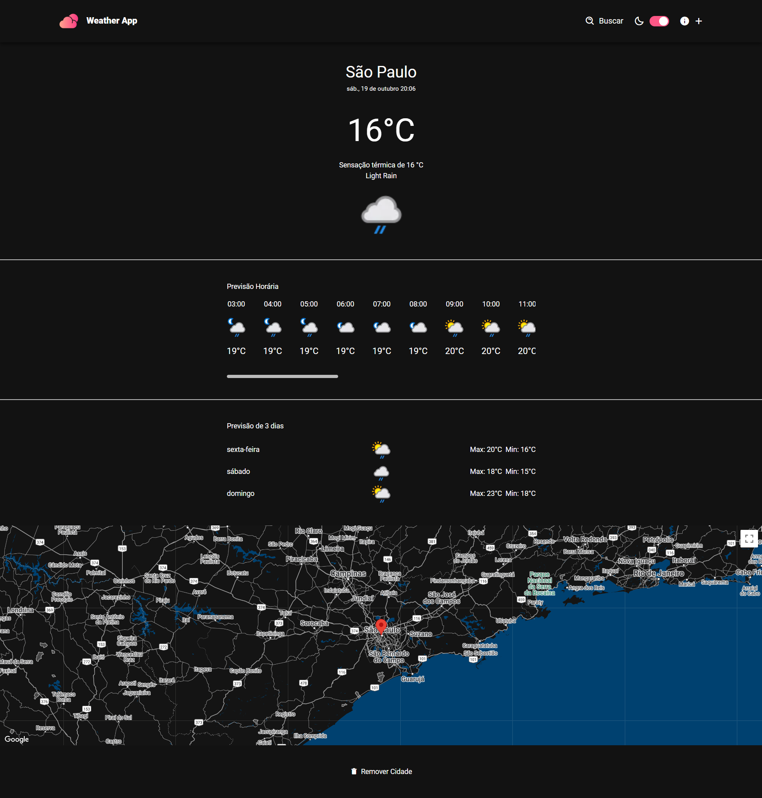

<h1 align="center">
  Weather App
</h1>

O Weather App é uma aplicação Vue.js que permite acompanhar o clima atual e futuro de cidades de sua escolha. A aplicação utiliza APIs para buscar dados meteorológicos e geocodificação, e oferece uma interface intuitiva para adicionar e remover cidades, bem como visualizar suas condições climáticas.

<p align="center">
  
</p>

## 💻 Visão Geral

O Weather App é uma aplicação web desenvolvida para fornecer informações meteorológicas precisas e em tempo real para os usuários. Ele permite que os usuários pesquisem por qualquer cidade no mundo e obtenham detalhes sobre a temperatura atual, condições climáticas, umidade, vento e previsão para os próximos dias. Com uma interface intuitiva e responsiva, o Weather App é ideal para pessoas que precisam de atualizações rápidas sobre o clima, seja para planejar suas atividades diárias ou viagens.

Agora, a aplicação utiliza a **WeatherAPI** para obter dados meteorológicos confiáveis e atualizados. Além disso, integra a **Google Maps API** para mostrar a localização das cidades pesquisadas, garantindo que os usuários tenham acesso a informações visuais e detalhadas sobre os lugares. O aplicativo também inclui um modo escuro que se adapta automaticamente às preferências do usuário ou do sistema operacional, proporcionando uma experiência de uso agradável em qualquer ambiente.

## ⚙️ Funcionalidades

- **Busca de Cidades:** Pesquise cidades ou estados e visualize os resultados.
- **Visualização do Clima:** Veja o clima atual, temperatura máxima e mínima para cidades salvas.
- **Adição e Remoção de Cidades:** Adicione cidades à lista de monitoramento e remova-as quando desejar.
- **Geolocalização:** Mostre a localização da cidade pesquisada no mapa.
- **Modo Escuro:** Alternar entre modo claro e escuro para melhor visualização.

## 🛠️ Tecnologias

Aqui estão as principais tecnologias utilizadas neste projeto:

- **Vue.js:** Framework JavaScript para construção da interface de usuário.
- **Vue Router:** Gerenciamento de rotas para navegação entre páginas.
- **Axios:** Cliente HTTP para requisições de dados.
- **TailwindCSS:** Framework de CSS para estilização.
- **Google Maps API:** API para geocodificação e visualização de mapas.
- **WeatherAPI:** API para obtenção de dados meteorológicos.

<br>

# 🛠️ Instalação

### Requisitos

- Node.js (versão 14 ou superior)
- npm (versão 6 ou superior)

### Passos

1. **Clone o repositório:**

```sh
git clone https://github.com/RodrigoRodrigues-Dev/weather-app.git

cd weather-app

### Passos

1. **Clone o repositório:**

```sh
git clone https://github.com/RodrigoRodrigues-Dev/weather-app.git

cd weather-app
```

2. **Instale as dependências:**

```sh
npm install
```
<br>

# 🚀 Uso
Para iniciar a aplicação em modo de desenvolvimento, execute:


```sh
npm run dev
```
Para construir o projeto para produção, utilize:
```sh
npm run build
```
<br>

## 📃 Licença
Este projeto está licenciado sob a Licença MIT - veja o arquivo [LICENSE](LICENSE) para mais detalhes.
<br>


## ☎️ Contato
Desenvolvido por [Rodrigo Rodrigues](https://github.com/RodrigoRodrigues-Dev). Entre em contato por 📧 [rodrigorodriguesdevcontato@gmail.com](mailto:rodrigorodriguesdevcontato@gmail.com)